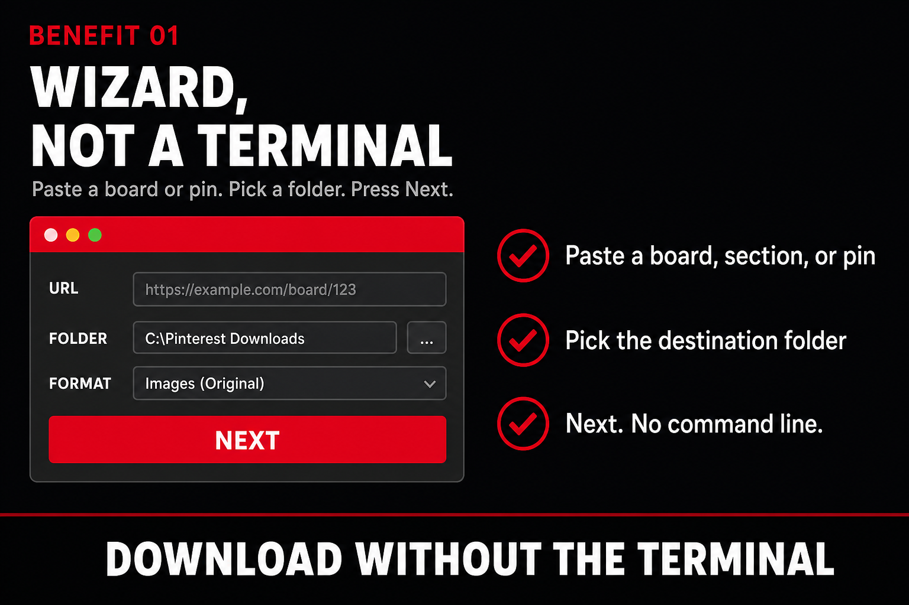
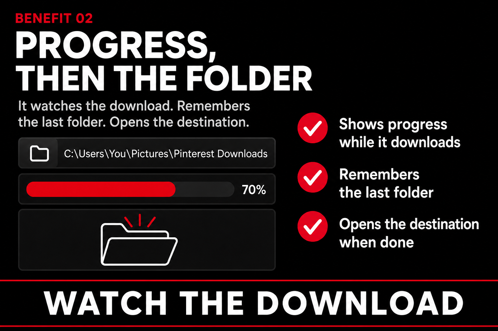
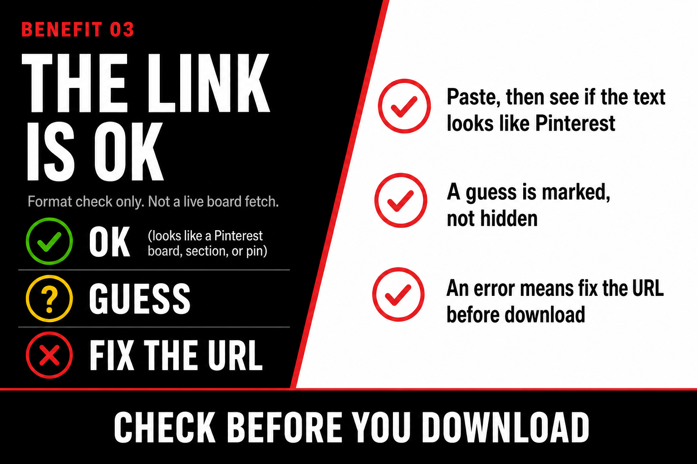

<h1 align="center">Pinterest Downloader CHK</h1>

<strong>A desktop window for downloading Pinterest boards, sections, and pins. Mac and Windows (Tk).</strong>

  

  <a href="#open">Open</a> &nbsp;·&nbsp;
  <a href="#what-problem-does-this-repo-solve">Problem</a> &nbsp;·&nbsp;
  <a href="#3-top-things-you-can-do-with-this-repo">3 top things</a> &nbsp;·&nbsp;
  <a href="#credits">Credits</a>

---

## What problem does this repo solve?

The original project is a **terminal**. You should not have to paste a board URL into a CLI to get the pictures off it. This repo is the **window**: paste a board, section, or pin, pick a folder, press Next.

> This is not [limkokhole/pinterest-downloader](https://github.com/limkokhole/pinterest-downloader). That repo is the engine. This one is the GUI.

---

## 3 top things you can do with this repo

1. **Paste, pick a folder, Next.** Wizard, not a terminal.
2. **Watch the download, then land in the folder.** It remembers the last folder and opens the destination.
3. **See if the link looks right before you run it.** A **✓** means the text looks like a Pinterest board, section, or pin. A **?** is a guess. An error means fix the URL first. Format check only, not a live board fetch.

  

> **Wizard, not a terminal.** Paste a board or pin, pick a folder, press Next.

  

> **Progress, then the folder.** It watches the download, remembers the last folder, then opens the destination.

  

> **The link is ok.** Format check only, not a live board fetch.

---

## Open

To open the app:

- **Windows (no Python):** download [`Pinterest Downloader CHK.exe`](https://github.com/Chakhdz/pinterest-gui-downloader-chk/releases) from [GitHub Releases](https://github.com/Chakhdz/pinterest-gui-downloader-chk/releases) and double-click it.
- **Mac:** double-click `Pinterest Downloader CHK.command` (needs Python; runs `python3 pinterest_gui.py`).

To install on Windows once if you already have Python and want to rebuild the `.exe` locally, double-click `Install Pinterest Downloader CHK.bat`. Then open `Pinterest Downloader CHK.exe`.

Windows: if you already have Python and no `.exe` yet, `Pinterest Downloader CHK.bat` also opens the app. If Python is missing, it tells you. More on Windows: [LEEME_WINDOWS.md](LEEME_WINDOWS.md).

Do not commit `images/`.

---

## Credits

**CHK** (Carlos Chak Hernández) is a freelance illustrator and visual storyteller in Colima, Mexico. He holds an MA in Mexican Art History, is a doctoral researcher, and works on visual culture, prehispanic art, and museums. He teaches at FAyD, Universidad de Colima.

[chakhernandez.art](https://www.chakhernandez.art) · [Chakhdz](https://github.com/Chakhdz)

- Engine: limkokhole — `pinterest-downloader.py`
- GUI: CHK — `pinterest_gui.py`, `Pinterest Downloader CHK.command`

See [CREDITS.md](CREDITS.md).

Name, search, standalone copy

**Name:** Pinterest Downloader CHK. Search: `pinterest downloader chk`, `pinterest downloader mac`.

This repository is a **standalone public copy** (not a GitHub fork), so it can stay public. The engine file matches limkokhole (`pinterest-downloader.py` SHA `7b2765bb`).

---

## License

MIT. Engine copyright (c) 2020 limkokhole@gmail.com. See [LICENSE](LICENSE).
